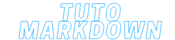

<h1 align="center">السلام عليكم 👋🏼</h1>

# 𝙰 𝚙𝚛𝚘𝚙𝚘𝚜 𝚍𝚎 𝚖𝚘𝚒:

𝚂𝚊𝚕𝚊𝚖 𝚊̀ 𝚝𝚘𝚞𝚜, 𝚓𝚎 𝚜𝚞𝚒𝚜 𝙳𝙻𝚁 𝚎𝚝 𝚓𝚎 𝚜𝚞𝚒𝚜 𝚛𝚊𝚟𝚒 𝚍𝚎 𝚟𝚘𝚞𝚜 𝚊𝚌𝚌𝚞𝚎𝚒𝚕𝚕𝚒𝚛 𝚜𝚞𝚛 𝚖𝚘𝚗 𝙶𝚒𝚝𝙷𝚞𝚋. 𝙹'𝚎𝚜𝚙𝚎̀𝚛𝚎 𝚚𝚞𝚎 𝚖𝚎𝚜 𝚙𝚛𝚘𝚓𝚎𝚝𝚜 𝚟𝚘𝚞𝚜 𝚙𝚕𝚊𝚒𝚛𝚘𝚗𝚝 𝚎𝚝 𝚚𝚞𝚎 𝚟𝚘𝚞𝚜 𝚢 𝚝𝚛𝚘𝚞𝚟𝚎𝚛𝚎𝚣 𝚝𝚘𝚞𝚝 𝚌𝚎 𝚚𝚞𝚒 𝚟𝚘𝚞𝚜 𝚒𝚗𝚜𝚙𝚒𝚛𝚎. 💭

  

  

𝗧𝘂𝘁𝗼𝗿𝗶𝗲𝗹𝘀 𝗣𝗿𝗼𝗷𝗲𝘁𝘀 𝗔𝗰𝗮𝗱𝗲́𝗺𝗶𝗾𝘂𝗲𝘀:

𝗧𝘂𝘁𝗼𝗿𝗶𝗲𝗹𝘀 𝗲𝗻 𝗗𝗲𝘃:

𝙻𝚊𝚗𝚐𝚊𝚐𝚎𝚜 𝚞𝚝𝚒𝚕𝚒𝚜𝚎́𝚜:

𝙴𝚗 𝚝𝚛𝚊𝚒𝚗 𝚍'𝚊𝚙𝚙𝚛𝚎𝚗𝚍𝚛𝚎...

𝚁𝚎́𝚜𝚎𝚊𝚞𝚡 𝚂𝚘𝚌𝚒𝚊𝚞𝚡: 

<!--
**medex24/medex24** is a ✨ _special_ ✨ repository because its `README.md` (this file) appears on your GitHub profile.

Here are some ideas to get you started:

- 🔭 I’m currently working on ...
- 🌱 I’m currently learning ...
- 👯 I’m looking to collaborate on ...
- 🤔 I’m looking for help with ...
- 💬 Ask me about ...
- 📫 How to reach me: ...
- 😄 Pronouns: ...
- ⚡ Fun fact: ...
-->
